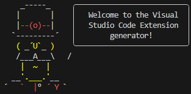
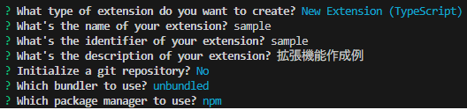
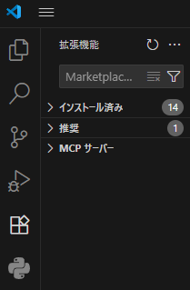

# vscode-extension_intro

この講座では、主に自身のコーディングの手助けとなるような拡張機能の作成と使用を目的としています。  
今回はTypeScriptの場合のみ説明していきます。  
JavaScriptで作る際も、大体は同じような流れです。分からないところがあったら聞いてください(何なら私は主にjsで作ってたので)


## 目次
1. [Node.jsのDLとinst](#1NodejsのDLとinst)  
2. [雛型の作成](#2雛型の作成)
3. [テンプレートの構造理解と実行環境作成](#3テンプレートの構造理解と実行環境作成)
4. [作成した拡張機能の実行](#4作成した拡張機能の実行)
5. [拡張機能の作成](#5拡張機能の作成)
6. [拡張機能のエクスポート](#6拡張機能のエクスポート)
7. [拡張機能のインポート](#7拡張機能のインポート)


## 1.Node.jsのDLとinst

[https://nodejs.org/ja/download](https://nodejs.org/ja/download)からNode.jsをDLしましょう。

# 後で画像貼る！

> [!NOTE]
> # npmになってることを確認みたいな旨を記述
> # LTSにしとき！
> その他の設定はそのままで大丈夫です

その後、DLしたインストーラーにてインストールしましょう。

> [!TIP]
> インストール後、VScodeを開きターミナル上で以下のコマンドを1行ずつ打ち込みます。
> ```bash
> node -v
> pnm -v
> ```
> それぞれのバージョンが表示されれば正しく入っています
> そうでなければ上手く入っていないため、再DLとかして頑張ってください


## 2.雛型の作成

今回は、テンプレートを利用して拡張機能を作っていきます

```bash
// 次の`yo`コマンドを作成するコマンド
npm install -g yo generator-code
// 拡張機能を作成するためのテンプレートを作成するコマンド
yo code
```

可愛いおじさんの質問にええ感じに答えていきましょう。

　

以下、特に重要(と主が思っている)部分を抜粋

```
? What type of extension do you want to create?
// どういう型で作りたい？って質問。今回はTypeScriptの場合で説明するので1番上のまま`Ender`
? What's the identifier of your extension?
// そのままエンター押せば何とかなる(らしい)
? Initialize a git repository?
// gitリポジトリを作るならここ
// (既にリポジトリをクローンした中でyと答えると二重になるため注意by前科1犯)
? Which package manager to use?
// ここはnpmを選択
```



ここまで入れるとぶわーって色々出てきます、待ちましょう

```
? Do you want to open the new folder with Visual Studio Code?
```

これが表示されれば、テンプレートは無事作成されました！  
そのまま`Ender`を押し、作成したファイルを開きましょう

> [!WARNING]
> 先ほど作成したフォルダを開かないと、のちに実行できなくなるので注意
> ターミナルでの現在参照だけでなく、開いているファイルが先ほどのファイルなことを確認してください。
> ###### 資料作る時に何度も繰り返しました、みんなは気を付けよう！

これで、無事に拡張機能のテンプレートを作成し、開くことができました㊗


## 3.テンプレートの構造理解と実行環境作成

では実際にコードを作っていきましょう！  
……の前に、まず何が何なのかを知らないといけませんよね。

以下が今回主に説明する、最低限知っといた方が良いファイルです

- `package.json`
    - 拡張機能の設定をするファイル
    - 名前やバージョン、どのファイルを実行するかなどのデータが入っている
- `src/extension.ts`
    - 実際に拡張機能の処理を書くファイル
    - 拡張機能実行時にどのような動きをするかを記述する

> [!WARNING]
> 勿論その他のファイルやフォルダも必要ですので、**絶対に**消さないでください

それでは実際に拡張機能を動かしてみましょう！

```bash
npm run compile
```

このコマンドをターミナル上で実行してみましょう。
1つフォルダが増えたことに気付きましたか？  
`out`というフォルダが作られ、中に色々ファイルやらフォルダやらが出来ましたね  
ここで1つ、めちゃめちゃ大事なファイルが作成されました。

- `out/extension.js`
    - `src/extension.ts`を元にして作られたjsファイル
    - 実際にはこのファイルが実行される

これで実際に動かせる環境は揃いました！  
`Fn`+`F5`を押せば「拡張機能開発ホスト」という、今作っている拡張機能が実際に動くような新しいVScodeのウィンドウが表示されます。

次のセクションで、サンプルにある機能を実行してみましょう！


## 4.作成した拡張機能の実行

先ほど出てきた「拡張機能ホスト」というウィンドウから、今作っている拡張機能をテストすることができます。  
それではここで、サンプルにある機能を実際に使ってみましょう。

`yo code`で作ったテンプレートは、「VScodeのコマンドパレットに`Hello World`と入れると、`Hello World from sample!`と表示される」という機能を持ってます。  
では、実際に動かしてみましょう。

`Ctrl`+`Shift`+`P`でコマンドパレットを開き、`Hello World`と打ち選択しましょう。  
すると、右下の通知に`Hello World from (拡張機能名)!`と表示されることと思います。

なんて~~カス~~素晴らしい拡張機能なんでしょう！！！


## 5.拡張機能の作成

では、この~~カス~~素晴らしいコードを編集して、実際に自分が作りたいような拡張機能を作りましょう！  
`src/extension.ts`の中身を編集することで、コードを機能に追加することができます。

どのようなものを作りたいか・実際に中身をどう作るかなどは今回の講座の範囲外なので、自分で調べてやりたいようにやってください。

実際にコードが上手く動いているかを確認するために、随時動かすことと思います。  
まずは`out/extension.js`を現在のtsに書いたコードに更新するため、ターミナルに先ほども用いた`npm run compile`を打ち込みます。これでtsをjsに書き換えることができました。  
そして`Ctrl`+`Shift`+`F5`を押すことで、先ほど開いた拡張機能ホストを再起動し、更新したjsファイルを元にした拡張機能を試しに動かすことができます。

> [!IMPORTANT]
> ここで、それぞれ重要なコマンドとショートカットをおさらいしましょう。
> 
> ターミナルへの`npm run compile`  
> →実際にコードを打ち込んでいる
> 
> `src/extension.ts`を元に、実際に動かすファイル`out/extension.js`を作成・更新
> 
> `Fn`+`F5`  
> →拡張機能ホストを**起動**する。1番最初(=ウィンドウをまだ作成していないとき)はこれ。
> 
> `Ctrl`+`Shift`+`F5`  
> →拡張機能ホストを**再起動**する。2回目以降(=ウィンドウを既に作成しているとき)はこれ。


## 6.拡張機能のエクスポート

早く中身を作りたくてソワソワしていると思いますが、先に出力の仕方を知っちゃいましょう。  
今回は、`.vsix`というファイルを作成しインポートする方法を紹介します。  
自分は勿論、ファイルを配布すれば誰でも使えるようになります。ｽｺﾞｲﾈ!

パッケージ化する前に、`README.md`を編集しないとエラーが出るので、適当に全部消すなりしましょう。  

> [!NOTE]
> この`README.md`は本来、名前・説明・現在のバージョンや既出バグなどを利用者に伝えるため書き込む場所です。
> しかし拡張機能本体には関係ないのでご安心を。
> というか、`.vsix`ファイルの配布でしたら何も関係ないですこれ。

そしてターミナルで、以下のコマンドを実行しましょう。

```bash
// "Visual Studio Code Extension"をインストール
npm install -g @vscode/vsce
// 作成した拡張機能のファイル作成
vsce package
```

> [!NOTE]
> gitリポジトリが無いとかライセンス化が云々とか言われるかもしれませんが、テストなのでそのまま進めちゃってください。  

`DONE`がドーンと表示されれば、先ほどのフォルダに`(拡張機能名)-0.0.1.vsix`というファイルが作られていると思います。


## 7.拡張機能のインポート

先ほどエクスポートしたファイルをインポートすることで、どのウィンドウでも拡張機能が使えるようにしましょう。

VScodeの一番左にあるバーにある、正方形4つの`拡張機能`をクリックし開きます。  
出てきたタブの右上にある三点リーダーから、`VSIXからのインストール`を選択し、先ほど作成した.vsixファイルを選択します。



これで、無事に拡張機能をインポートできたはずです。

では、実際にVScodeを再起動して、インポートされているか確かめてみましょう。

拡張機能タブの三点リーダーから、`実行中の拡張機能の表示`を選択してください。  
すると中に、先ほど作った名前の拡張機能が入っているはずです。  
実際に、先ほど拡張機能ホストで動かしたように`Ctrl`+`Shift`+`P`でコマンドパレットを開き、`Hello World`と打ち選択してみましょう。拡張機能ホストと同じ通知が、右下に表示されるはずです。
