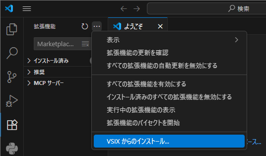

# vscode-extension_intro

この講座では、主に自身のコーディングの手助けとなるような拡張機能の作成と使用を目的としています。  
今回はTypeScriptの場合のみ説明していきます。  
JavaScriptで作る際も、大体は同じような流れです。分からないところがあったら聞いてください(何なら私は主にjsで作ってたので)


## 目次
1. [Node.jsのDLとinst](#1NodejsのDLとinst)  
2. [雛型の作成](#2雛型の作成)
3. [テンプレートの構造理解と実行環境作成](#3テンプレートの構造理解と実行環境作成)
4. [作成した拡張機能の実行](#4作成した拡張機能の実行)
5. [拡張機能の作成](#5拡張機能の作成)
6. [拡張機能のエクスポート](#6拡張機能のエクスポート)
7. [拡張機能のインポート](#7拡張機能のインポート)


## 1.Node.jsのDLとinst

[https://nodejs.org/ja/download](https://nodejs.org/ja/download)からLTS版をDLする。

> [!NOTE]
> そのほかの設定はそのままで大丈夫(多分)

その後、インストーラーでインストールする。

> [!TIP]
> ターミナルに以下のコマンドを1行ずつ打ち込む
> ```bash
> node -v
> pnm -v
> ```
> それぞれバージョンが表示されれば正しく入っています  
> そうでなければ上手く入っていないため、良い感じに頑張ってください


## 2.雛型の作成

今回は、テンプレートを作成して拡張機能を作っていきます

```bash
// 次の`yo code`を使えるようにするための作成コマンド
npm install -g yo generator-code
// 拡張機能を作成するためのテンプレートを作成する
yo code
```

→可愛いおじさんの質問にええ感じに答えていく  
　  
以下、特に重要(と主が思っている)部分を抜粋

```
? What type of extension do you want to create?
// どういう型で作りたい？ってやつ。今回はTypeScriptの場合で説明します
? What's the identifier of your extension?
// そのままエンター押せば何とかなる(らしい)
? Initialize a git repository? No
// gitリポジトリを作るならここ
// (既にリポジトリをクローンした中でy答えると二重になるから注意by前科1犯)
? Which package manager to use? npm
// ここはnpmを選択
```

  
ここまで入れるとぐわーって色々出てきます、待ちましょう

```
? Do you want to open the new folder with Visual Studio Code?
// 作成したファイルを開くかの質問、そのままエンター
```

> [!WARNING]
> 先ほど作成したフォルダ以外が親となると、のちにテスト運行ができなくなるので注意  
> ###### 資料作る時に何度も繰り返しました、みんなは気を付けよう！

これで、無事に拡張機能のテンプレートを作成し、開くことができました㊗


## 3.テンプレートの構造理解と実行環境作成

では実際にコードを作っていきましょう！  
……の前に、まず何が何なのかを知らないといけませんよね

以下が今回主に説明するファイルです

- `package.json`
    - 拡張機能の設定をするファイル
    - 名前やバージョン、どのファイルを実行するかなどの大切なデータが入っている
- `src/extension.ts`
    - 実際に拡張機能の処理を書くファイル
    - 拡張機能実行時にどのような動きをするかを記述する

実際に作成中の拡張機能を動かしてみましょう！

```bash
npm run compile
```

このコマンドを実行してみましょう。
これで1つフォルダが増えたことに気付きましたか？  
`out`というフォルダが作られ、中に色々出来ましたね  
ここで一つ、めちゃめちゃ大事なファイルが作成されました

- `out/extension.js`
    - `src/extension.ts`を元にして作られたjsファイル
    - 実際にはこのファイルが実行される

これで実際に動かせる環境は揃いました！  
`Fn`+`F5`を押せば「拡張機能開発ホスト」という、今作ってる拡張機能が実際に動くような新しいVScodeのウィンドウを作れます  

次のセクションで、実際にサンプルとして作られている機能を実行してみましょう！


## 4.作成した拡張機能の実行

先ほど出てきた「拡張機能ホスト」というウィンドウから、テストとして今作っている拡張機能を試しに使うことができます。  
ここで一つ、元々ある機能を実際に使ってみましょう。

`yo code`にて作られたテンプレートは、「VScodeのコマンドパレットに`Hello World`と入れると、`Hello World from sample!`と表示される」という機能を持ってます。  
では、実際に動かしてみましょう。

`Ctrl`+`Shift`+`P`でコマンドパレットを開き、`Hello World`と打ち選択しましょう。  
すると、右下の通知に`Hello World from sample!`と表示されることと思います。

#### なんて~~カス~~素晴らしい拡張機能なんでしょう！！！


## 5.拡張機能の作成

では、この~~カス~~素晴らしいコードを編集して、実際に自分が作りたいような拡張機能を作りましょう！  
`src/extension.ts`の中身を編集することで、コードを機能に追加することができます。

正直中身をどう作るかは今回の講座の範囲外なので、自分で調べてやりたいようにやってください。

実際にコードが上手く動いているかを確認するために、随時動かすことと思います。  
先ほどの`out/extension.js`を更新するため、ターミナルに先ほども打ち込んだ`npm run compile`を打ち込みます。これでtsをjsに書き換えることができました。  
そして`Ctrl`+`Shift`+`F5`を押すことで、拡張機能ホストを再起動し、先ほど更新したjsファイルを元にした拡張機能を試すことができます。

> [!IMPORTANT]
> ターミナルへの`npm run compile`  
> →実際にコードを打ち込んでいる`src/extension.ts`を元に、実際に動かすファイル`out/extension.js`を作成・更新  
> `Fn`+`F5`  
> →拡張機能ホストを**起動**する。1番最初はこれ。  
> `Ctrl`+`Shift`+`F5`  
> →拡張機能ホストを**再起動**する。2回目以降に動かすときはこれ。


## 6.拡張機能のエクスポート

早く中身を作りたくてソワソワしていると思いますが、先に出力の仕方を知っちゃいましょう。  
今回は、`.vsix`というファイルを作成しインポートすることで使えるようにします。  
自分は勿論、そのファイルを配布すれば他の人も使えるようになります。ｽｺﾞｲﾈ!

パッケージ化する前に、`README.md`を編集しないといけないという謎エラーが出るので、適当に全部消すなりしましょう。  
そしてターミナルで、以下のコマンドを実行しましょう。

```bash
// "Visual Studio Code Extension"というのをインストール
npm install -g @vscode/vsce
// 作成した拡張機能をパッケージ化
vsce package
```
> [!NOTE]
> gitリポジトリが無いとかライセンス化が云々とか言われるんですが、テストなのでそのまま進めちゃってください。  

`DONE`と表示されれば、先ほどまでのフォルダに`(ファイル名)-0.0.1.vsix`というファイルが作られていると思います。  


## 7.拡張機能のインポート

このままだと、拡張機能ホストでしか実行することができません。  
ここで、どのウィンドウでも拡張機能が使えるようにインポートしましょう。

VScodeの一番左にあるバーで、正方形が4つある`拡張機能`を開きます。  
出てきた部分の右上にある三点リーダーから、`VSIXからのインストール`を選択し、先ほど作成した.vsixファイルを選択します。  
  
これで、無事に拡張機能をインポートできたはずです。

では、実際にVScodeを再起動して、入っているかを確かめてみましょう。  
拡張機能タブの三点リーダーから、`実行中の拡張機能の表示`を選択してください。  
すると中に、先ほど作った名前の拡張機能が入っているはずです。  
実際に`Ctrl`+`Shift`+`P`でコマンドパレットを開き、`Hello World`と打ち選択してみましょう。拡張機能ホストで出たような通知が、右下に表示されるはずです。
